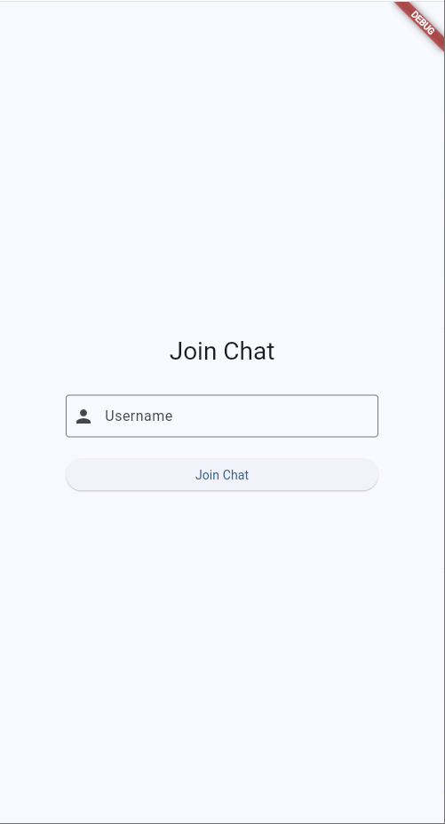
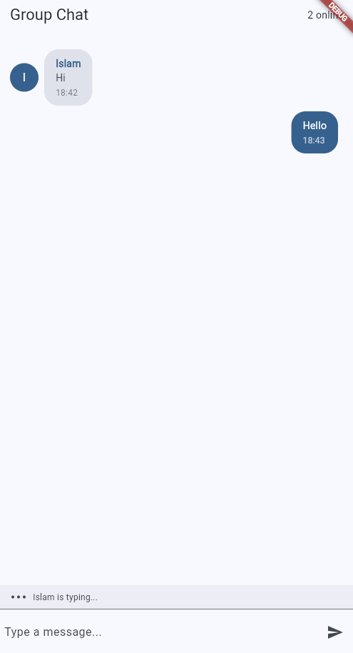

# Real-Time Group Chat App

A real-time group chat application built with Flutter and Socket.IO.

## Project Structure
```
chat_group_app/
├── frontend/           # Flutter application
│   ├── lib/
│   │   ├── bloc/      # BLoC state management
│   │   ├── models/    # Data models
│   │   ├── screens/   # UI screens
│   │   ├── services/  # Socket.IO service
│   │   └── widgets/   # Reusable widgets
│   └── pubspec.yaml   # Flutter dependencies
│
└── backend/            # Golang Socket.IO server
    ├── main.go         # Server source code
    └── go.mod          # Go dependencies
```

## Setup Instructions

### Backend Setup
1. Navigate to the backend directory:
   ```bash
   cd backend
   ```
2. Install dependencies:
   ```bash
   go mod download
   ```
3. Start the server:
   ```bash
   go run main.go
   ```

### Frontend Setup
1. Navigate to the frontend directory:
   ```bash
   cd frontend
   ```
2. Install dependencies:
   ```bash
   flutter pub get
   ```
3. Run the app:
   ```bash
   flutter run
   ```

## Features
- Real-time messaging using Socket.IO
- Clean architecture with BLoC pattern
- User join/leave notifications
- Typing indicators
- Message timestamps
- Emoji picker
- Dark mode support

## Tech Stack
- Frontend: Flutter
- Backend: Golang with Socket.IO
- State Management: BLoC
- Real-time Communication: Socket.IO/WebSockets 

## Screenshots

### Join Screen

*Users can enter their username to join the chat*

### Chat Interface

*Real-time messaging with typing indicators and online users*